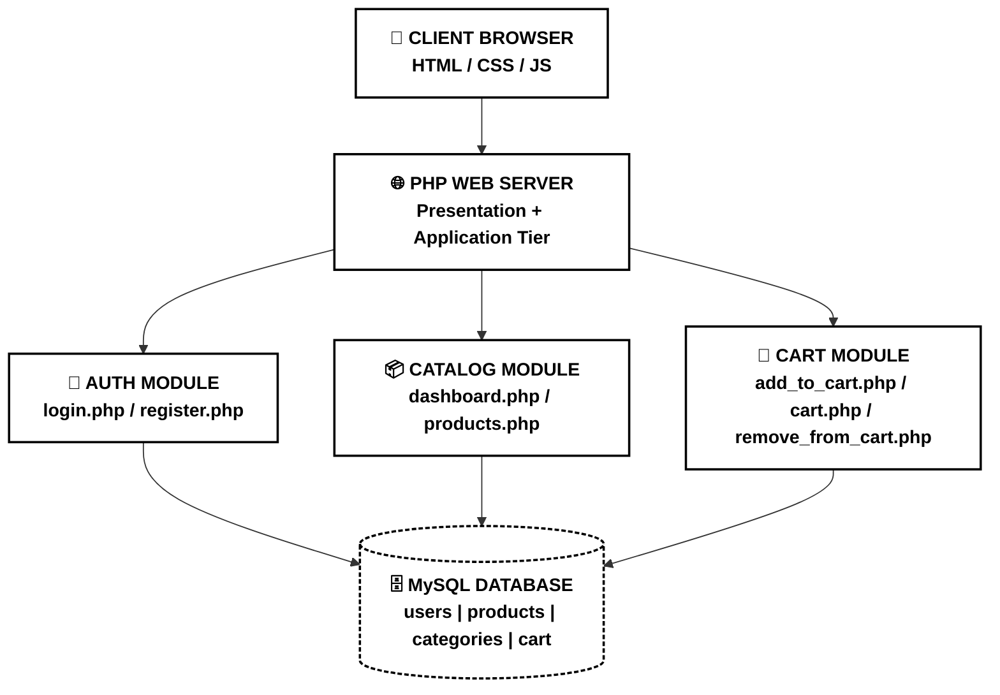
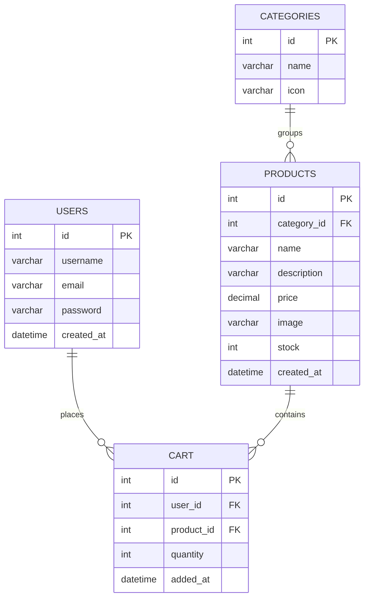

<div align="center">

# 🛒 DailyNeeds — PHP 3-Tier E-Commerce Application

### A Full CI/CD Powered Grocery Store | Jenkins • Docker • SonarQube • Trivy • DockerHub


**Status:**    

</div>

---

## 📖 Overview

**DailyNeeds** is a PHP-based **3-Tier grocery e-commerce web application** built with a **Presentation Layer (HTML/CSS/PHP)**, an **Application Layer (PHP business logic)**, and a **Data Layer (MySQL)**.

The project went through a **complete DevOps lifecycle** — from writing code, to static code analysis, quality gating, containerization, vulnerability scanning, registry push, manual approval, and finally deployment via **Docker Swarm** — all automated through a **Jenkins Declarative Pipeline**.

Midway through the project, the client requested a **UI overhaul** — the original **Green Classic theme (v1)** was redesigned into a **Premium Dark Blue theme (v2)**. Both versions were developed, tested, and deployed independently via separate Jenkins pipeline runs, and are documented side-by-side in this README.

---

## 🎨 UI Evolution — v1 (Green Classic) → v2 (Premium Blue)

| | v1 — Green Classic (`main` branch) | v2 — Premium Blue (`feature/UI-updating` branch) |
|---|---|---|
| **Theme** | Light, minimal, green accent | Dark, premium, blue accent with serif branding |
| **Server** | `23.23.42.206:8085` | `54.81.188.129:8080` |
| **Status** | ✅ Stable / Production | ✅ Tested & Released |

### 🔑 Login Page
| v1 | v2 |
|---|---|
|  |  |

### 📝 Register Page
| v1 | v2 |
|---|---|
|  |  |

### 🏠 Dashboard / Home Page
| v1 | v2 |
|---|---|
|  |  |

### 🥕 Vegetables Category
| v1 | v2 |
|---|---|
|  |  |

### 🍎 Fruits Category
| v1 | v2 |
|---|---|
|  |  |

### 🔌 Appliances Category
| v1 | v2 |
|---|---|
|  |  |

### ✏️ Stationery Category
| v1 | v2 |
|---|---|
|  |  |

### 🛒 Cart Page
| v1 | v2 |
|---|---|
|  |  |

> 📁 All original, full-resolution screenshots are available in [`/output-sccreenshots`](https://github.com/BRK-Devops/DailyNeeds-PHP-Docker/tree/main/output-sccreenshots)

---

## 🏗️ System Architecture

> Clean **black & white** architecture — no distracting colors, bold labels for clarity.



### 🔁 CI/CD Pipeline Flow

```mermaid
graph LR
    classDef box fill:#ffffff,stroke:#000000,stroke-width:2px,color:#000000,font-weight:bold;
    classDef gate fill:#ffffff,stroke:#000000,stroke-width:3px,color:#000000,font-weight:bold;

    A["<b>📥 SOURCE CHECKOUT</b><br/>GitHub: feature/UI-updating"] --> B["<b>🔍 STATIC CODE ANALYSIS</b><br/>SonarQube Scanner"]
    B --> C{"<b>✅ QUALITY GATE</b>"}
    C -- "<b>PASS</b>" --> D["<b>🐳 DOCKER IMAGE BUILD</b><br/>phpapplication:phpimage"]
    C -- "<b>FAIL</b>" --> Z["<b>⛔ PIPELINE ABORTED</b>"]
    D --> E["<b>🛡️ TRIVY VULNERABILITY SCAN</b>"]
    E --> F["<b>📤 PUSH TO DOCKERHUB</b><br/>brkdockerhub/phpapplication"]
    F --> G["<b>🙋 MANUAL APPROVAL</b><br/>'Can I deploy DailyNeeds?'"]
    G --> H["<b>🚀 DOCKER STACK DEPLOY</b><br/>docker stack deploy -c docker-compose.yml"]
    H --> I["<b>📧 EMAIL NOTIFICATION</b><br/>Build Status Report"]

    class A,B,D,E,F,G,H,I box
    class C gate
```



---

## 🧰 Tech Stack

| Layer | Technology |
|---|---|
| **Frontend** | HTML5, CSS3 (Custom premium blue theme in v2) |
| **Backend** | PHP (Vanilla, procedural) |
| **Database** | MySQL 8 |
| **Containerization** | Docker, Docker Compose, Docker Swarm |
| **CI/CD** | Jenkins (Declarative Pipeline) |
| **Code Quality** | SonarQube (Quality Gates) |
| **Security Scanning** | Trivy (Container Image Scanning) |
| **Registry** | DockerHub |
| **Notifications** | Jenkins Email Extension (Gmail SMTP) |
| **Infra** | AWS EC2 |

---

## 📂 Project Structure

```
DailyNeeds-PHP-Docker/
│
├── config/                     # DB & environment configuration
├── css/                        # Stylesheets (v1 green / v2 premium blue)
├── output-sccreenshots/        # All UI, DB, Pipeline & SonarQube screenshots
│
├── Dockerfile                  # PHP application image definition
├── docker-compose.yml          # Multi-service stack (App + MySQL)
├── init.sql                    # Database schema + seed data
│
├── index.php                   # Landing / router
├── login.php                   # User login
├── register.php                # User registration
├── logout.php                  # Session termination
├── dashboard.php                # Category browser (Vegetables/Fruits/Appliances/Stationery)
├── products.php                # Product listing by category
├── add_to_cart.php             # Add item to cart
├── cart.php                    # View / manage cart
├── remove_from_cart.php        # Remove cart item
│
└── README.md
```

📌 **Repo:** [`BRK-Devops/DailyNeeds-PHP-Docker`](https://github.com/BRK-Devops/DailyNeeds-PHP-Docker) — `main` branch, 4 branches, 15 commits

---

## 🗃️ Database Schema

The app uses a single MySQL database `dailyneeds` with **4 relational tables**:



### 📊 Live Data Snapshot (from screenshots)

**Categories (4 rows)**

| id | name | icon |
|---|---|---|
| 1 | Vegetables | fa-carrot |
| 2 | Fruits | fa-apple-alt |
| 3 | Appliances | fa-blender |
| 4 | Stationery | fa-pen |

**Products (20 rows total — 5 per category)**, e.g. Carrot ₹40, Mango ₹120, Mixer Grinder ₹2,500, Pens ₹50, Microwave Oven ₹4,500 — full catalog seeded via `init.sql`.

**Users** — passwords stored as **bcrypt hashes** (`$2y$10$...`), confirming secure password handling in `register.php` / `login.php`.

**Cart** — transactional rows linking `user_id` → `product_id` with `quantity` and `added_at` timestamp, verified live for both v1 (`user_id=2`, 4 items, ₹4,640 total) and v2 (`user_id=1`, 4 items, ₹2,015 total).

| DB Table | v1 Evidence | v2 Evidence |
|---|---|---|
| `products` | ✅ 20 rows confirmed | ✅ Same schema |
| `categories` | ✅ 4 rows confirmed | ✅ Same schema |
| `users` | ✅ 2 registered users | ✅ 1 registered user (`rohitkumar.b`) |
| `cart` | ✅ 4 active cart items | ✅ 4 active cart items |

### 🖥️ SQL Query Output — Live Database Screenshots

**v1 — `main` branch** (queried individually per table)

| `products` | `categories` |
|---|---|
|  |  |

| `users` | `cart` |
|---|---|
|  |  |

**v2 — `feature/UI-updating` branch** (`users`, `cart` & `categories` queried together)

<p align="center">

</p>

---

## ⚙️ CI/CD Pipeline — Jenkins Declarative Script

Pipeline name: **`dev pipeline`** | Agent: `node { label 'prod' }`

| Stage | Purpose | Key Command / Config |
|---|---|---|
| **1. code** | Checkout source | `git branch: 'feature/UI-updating', url: 'https://github.com/BRK-Devops/DailyNeeds-PHP-Docker.git'` |
| **2. CQA** | Static code analysis | `withSonarQubeEnv("CQA-analysis")` → `sonar-scanner -Dsonar.projectKey=myproject` |
| **3. QualityGatesCheck** | Enforce quality standards | `waitForQualityGate abortPipeline: true` (2 min timeout) |
| **4. DockerImageBuild** | Build container image | `docker build -t brkdockerhub/phpapplication:phpimage .` |
| **5. DockerScan-Trivy** | Vulnerability scanning | `trivy image brkdockerhub/phpapplication:phpimage` |
| **6. DockerHub-registrypush** | Push to registry | `withDockerRegistry(...)` → `docker push brkdockerhub/phpapplication:phpimage` |
| **7. deploy through Stack** | Manual gated deployment | Input: *"Can I deploy the application - DailyNeeds ?"* → `docker stack deploy -c docker-compose.yml DailyNeeds` |
| **post \| always** | Build notification | Email sent to `behara.rohitkumar1@gmail.com` with build status + log URL |

📸 **Pipeline script references:**

| Pipeline Script (1) | Pipeline Script (2) |
|---|---|
|  |  |

**Post-Build Actions:**


### 📧 Sample Build Notification
> **Subject:** Build Status: dev pipeline #19
> **Result:** ✅ SUCCESS
> **Log:** `http://23.23.42.206:8080/job/dev%20pipeline/19/`

---

## 📊 Real-Time Quality Metrics (SonarQube)

Captured directly from live SonarQube dashboards for **both releases**:

### 🟢 v1 — `main` branch (Overall Code)

| Metric | Result | Rating |
|---|---|---|
| **Quality Gate** | ✅ **Passed** — All conditions passed | — |
| **Bugs** | 0 | 🟢 A (Reliability) |
| **Vulnerabilities** | 0 | 🟢 A (Security) |
| **Security Hotspots** | 7 (0.0% reviewed) | 🔴 E (Security Review) |
| **Code Smells** | 44 | 🟢 A (Maintainability) |
| **Technical Debt** | 1h 35min | — |
| **Coverage** | 0.0% on 148 lines | ⚪ Not covered |
| **Duplications** | 0.0% on 674 lines, 0 duplicated blocks | 🟢 Clean |
| **Analyzed** | July 2, 2026 · 11:15 AM | — |

### 🔵 v2 — `feature/UI-updating` branch (New Code)

| Metric | Result | Rating |
|---|---|---|
| **Quality Gate** | ✅ **Passed** — All conditions passed | — |
| **New Bugs** | 0 | 🟢 A (Reliability) |
| **New Vulnerabilities** | 0 | 🟢 A (Security) |
| **New Security Hotspots** | 0 | 🟢 A (Security Review) |
| **Added Debt / New Code Smells** | 0 / 0 | 🟢 A (Maintainability) |
| **Coverage / Duplication (new lines)** | Not applicable — 0 new lines | — |
| **Analyzed** | July 2, 2026 · 12:49 PM | — |

| v1 | v2 |
|---|---|
|  |  |

> ⚙️ Quality Gate used: **SonarQube built-in default ruleset ("Sonar way")** — both releases passed with **zero bugs and zero vulnerabilities**.

---

## 🛡️ Security Scanning — Trivy

Every image is scanned **before** being pushed to DockerHub:

```bash
trivy image brkdockerhub/phpapplication:phpimage
```

This stage runs immediately after `DockerImageBuild` and blocks promotion of vulnerable images to the registry.

---

## 🐳 Docker Image & Registry

| Property | Value |
|---|---|
| **Repository** | `brkdockerhub/phpapplication` |
| **Tag** | `phpimage` |
| **Image Size** | 208.2 MB |
| **Pulls** | 11 |
| **Last Pushed** | via Jenkins `DockerHub-registrypush` stage |


```bash
docker push brkdockerhub/phpapplication:phpimage
```

---

## 🚀 Deployment

Final deployment is **gated by manual approval** inside Jenkins, then rolled out as a **Docker Swarm stack**:

```bash
docker stack deploy -c docker-compose.yml DailyNeeds
```

| Environment | URL | Theme |
|---|---|---|
| **v1 (Stable)** | `http://23.23.42.206:8085` | Green Classic |
| **v2 (Released)** | `http://54.81.188.129:8080` | Premium Blue |

---

## 🖥️ Local Setup

```bash
# Clone the repository
git clone https://github.com/BRK-Devops/DailyNeeds-PHP-Docker.git
cd DailyNeeds-PHP-Docker

# Build & run using Docker Compose
docker compose up -d --build

# App will be available at
http://localhost:8085
```

Database auto-initializes from `init.sql` (4 tables: `users`, `categories`, `products`, `cart`).

---

## ✨ Features

- 🔐 Secure registration & login with **bcrypt password hashing**
- 🗂️ Category-based product browsing (Vegetables, Fruits, Appliances, Stationery)
- 🛒 Add-to-cart, view cart, and remove-from-cart with live totals
- 🎨 Fully redesigned **premium dark-blue UI** (v2) delivered on client request
- ⚙️ End-to-end **automated CI/CD** — code → quality gate → build → scan → push → approve → deploy
- 📧 Automated email build notifications
- 🐳 Containerized & deployed via **Docker Swarm**

---

## 🔭 Future Enhancements

- [ ] Add unit test coverage (currently 0%) to strengthen the SonarQube Coverage metric
- [ ] Resolve outstanding **7 Security Hotspots** flagged in v1
- [ ] Implement real payment gateway ("Checkout feature coming soon" currently a placeholder)
- [ ] Migrate to HTTPS (currently served over plain HTTP)

---

## 📁 All Screenshots

Full evidence set available in [`/output-sccreenshots`](https://github.com/BRK-Devops/DailyNeeds-PHP-Docker/tree/main/output-sccreenshots), including UI pages (v1/v2), database query outputs, Jenkins pipeline scripts, post-build actions, SonarQube reports, and DockerHub registry.

---

<div align="center">

### 👨‍💻 Author

**Behara Rohit kumar** — **Software Engineer-DevOps**
📧 behara.rohitkumar1@gmail.com

*Built with PHP, secured with SonarQube & Trivy, shipped with Jenkins & Docker.*

</div>
